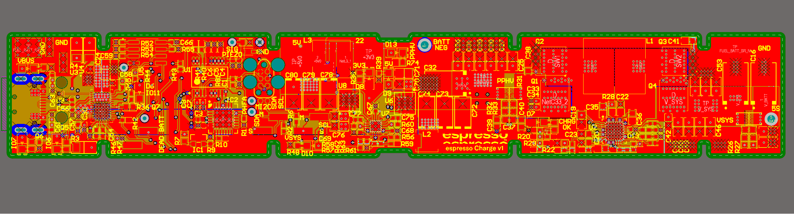
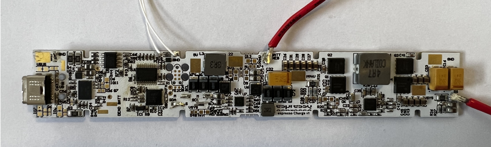

# PCB-Power-60W-Single-Port-USB-C-Powerbank-5S2P

This is a 6-layer board designed to be a single USB-C Port power bank-like board, capable of having 5s lithium-ion battery packs, and supplying up to 60W. It can also report battery level over an FTDI (Serial communication). Additionally, it features a Power Delivery (PD) chip and a charger chip for USB-C PD power negotiation.

## Key Components
- TPS257550 PD Controller from Texas Instruments
- BQ25731 Charge Controller from Texas Instruments
- STM32F030F4 MCU from ST

## System Details
- Operating System: FreeRTOS Kernel

## Images

